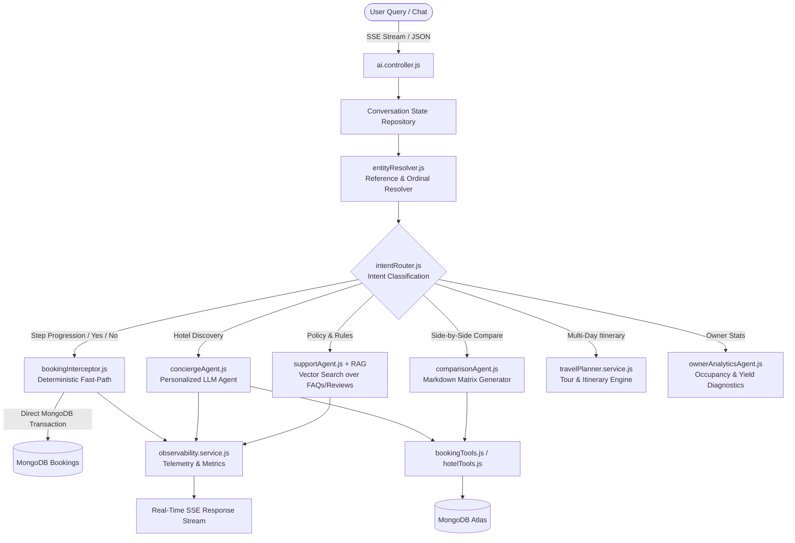

# 🏨 StayNest — Next-Gen AI-Powered Hospitality & Hotel Booking Platform

[](https://stay-next.vercel.app)
[](https://nodejs.org)
[](https://react.dev)
[](https://www.mongodb.com)
[](https://langchain.com)
[](https://groq.com)

> **StayNest** is a full-stack, enterprise-grade hotel booking and hospitality management ecosystem featuring an autonomous **Deterministic + Multi-Agent AI System**, real-time **RAG policy assistant**, dynamic pricing engine, waitlist auto-promotion, multi-gateway payments (Stripe, Razorpay, COD), and specialized portals for **Guests, Hotel Owners, and Administrators**.

---

## 🌐 Live Application & Demo Access

🔗 **Live URL:** [https://stay-next.vercel.app](https://stay-next.vercel.app)

### 🔑 Demo Credentials

| Role | Email | Password | Access / Portal |
| :--- | :--- | :--- | :--- |
| **🏨 Hotel Owner** | `smita.joshi@gmail.com` | `Password123@` | Owner Dashboard, Hotel Management, Analytics, Dynamic Pricing |
| **👤 Customer / Guest** | `demouser@gmail.com` | `Password123@` | Search, Instant Booking, AI Concierge, Wishlists, Waitlists |
| **🛡️ Administrator** | *Configurable via DB Role* | *Admin Auth* | Hotel Approvals, Platform Analytics, AI Observability |

---

## 🚀 Key Features

### 👤 1. Customer & Guest Experience
* **Smart Hotel Discovery & Search:** Real-time search with multi-filter support (city, state, price range, star ratings, and amenities).
* **Interactive Availability Calendar:** Day-by-day room inventory inspection with instant pricing preview.
* **Seamless Checkout & Multi-Payment Modes:**
  * 💳 **Stripe** (Credit / Debit cards, International payments)
  * 📱 **Razorpay** (UPI, Net Banking, Cards)
  * 🏨 **Pay at Hotel (Cash on Delivery / COD)**
* **Automated Waitlist System:** Join waitlists for sold-out rooms. Automatic reservation promotion occurs if a booking is cancelled.
* **Coupons & Promotional Offers:** Instant discount verification and dynamic price calculation.
* **Wishlist & Personalization:** Save preferred rooms/hotels; AI automatically tailors future recommendations based on past preferences.
* **Booking Lifecycle Management:** View real-time booking status, digital receipts, and one-click cancellation with automated refund processing.

---

### 🏨 2. Hotel Owner Portal (`/owner/dashboard`)
* **Property & Room Management:** List new hotels, create and manage rooms with multi-image Cloudinary uploads.
* **Dynamic Pricing Engine:** Set dynamic pricing rules based on seasonal demand, surge factors, and occupancy.
* **Interactive Booking Dashboard:** Track active, completed, and pending bookings with real-time revenue stats.
* **Coupon Creation:** Launch custom coupon codes with usage limits, expiry dates, and minimum spend thresholds.
* **Owner AI Business Advisor:** AI-driven occupancy diagnostics and revenue optimization recommendations.
* **Guest Live Chat:** Direct real-time communication channel between hotel owners and guests.

---

### 🛡️ 3. Admin & Operations Portal (`/admin/dashboard`)
* **Hotel Approvals Queue:** Review and verify newly submitted properties before making them public.
* **Platform Metrics:** Gross booking volume (GBV), active users, total revenue, and occupancy rate metrics.
* **AI Observability & Diagnostics:** Live telemetry tracking AI response latency, token consumption, intent breakdown, and tool execution logs.

---

## 🤖 Advanced AI System Architecture

StayNest utilizes a **Hybrid Multi-Agent & Deterministic Workflow Engine**. Instead of relying purely on LLMs for financial and transactional decisions (which causes hallucinations and booking errors), StayNest routes transactional flows through a deterministic state machine and conversational flows through specialized LLM agents.



### AI Components Breakdown:
1. **Deterministic Booking Interceptor:** When confirming a reservation (*"Confirm"*, *"Yes"*), the system executes MongoDB transactions directly without LLM latency or hallucination risks.
2. **Retrieval-Augmented Generation (RAG):** Indexes FAQs, house rules, cancellation policies, and guest reviews into vector embeddings for 100% accurate policy answers.
3. **Multi-Agent Specialist Cluster:**
   * **Booking Agent:** Manages date checks, availability, and booking queries with LangChain tool calling.
   * **Concierge Agent:** Personalizes luxury recommendations using stored traveler preferences.
   * **Support Agent:** Resolves cancellation and refund policy questions using RAG context.
   * **Comparison Agent:** Generates formatted comparative matrices across hotels.
   * **Travel Planner:** Synthesizes multi-day custom travel itineraries.
   * **Owner Analytics Agent:** Analyzes business performance metrics for owners.
4. **SSE Real-Time Streaming:** Streams tokens and live status indicators (`"Analyzing query..."`, `"Checking dates..."`) directly to the UI.

---

## 🛠️ Technology Stack

### **Frontend**
* **Core:** React 19, Vite, JavaScript (ESM)
* **Routing & State:** React Router DOM v6, Context API (`AuthContext`, `HotelContext`, `WishlistContext`)
* **Data Fetching:** TanStack React Query v5, Axios
* **UI & Styling:** Tailwind CSS, Lucide React Icons, React Hot Toast

### **Backend & AI**
* **Runtime & Framework:** Node.js (v20+), Express 5 (ES Modules)
* **Database & ODM:** MongoDB Atlas, Mongoose
* **AI & Orchestration:** LangChain, `@langchain/groq`, Groq (Llama 3.3 70B Versatile), Google Gemini Embeddings
* **Background Jobs & Crons:** `node-cron`, Redis, BullMQ
* **Security & Auth:** JWT (Access & Refresh Tokens), bcrypt, Helmet, Express Rate Limit, HPP, Mongo Sanitize
* **Media & Email:** Cloudinary SDK, Multer, Nodemailer

---

## 📁 Repository Structure

```plaintext
StayNest/
├── backend/
│   ├── index.js                      # Server entry point & DB/RAG initialization
│   ├── src/
│   │   ├── ai/                       # AI Subsystem
│   │   │   ├── agent/                # Specialized LLM Agents (Booking, Concierge, Support, etc.)
│   │   │   ├── analytics/            # Observability models & telemetry service
│   │   │   ├── memory/               # MongoDB Chat Memory & Long-Term User Preferences
│   │   │   ├── rag/                  # Vector Store & Hotel RAG Service
│   │   │   ├── router/               # Master Agent Router & Intent Classifier
│   │   │   ├── state/                # Conversation State Service & Schema
│   │   │   ├── streaming/            # Server-Sent Events (SSE) Stream Handler
│   │   │   ├── tools/                # LangChain Structured Dynamic Tools
│   │   │   ├── travel-planner/       # Multi-day itinerary planner service
│   │   │   └── workflow/             # Booking Interceptor & Entity Resolver
│   │   ├── api/cron/                 # Automated Background Cron Jobs
│   │   ├── controllers/              # REST API Controllers (Auth, Hotel, Booking, Payment, AI)
│   │   ├── middlewares/              # JWT Auth, Role Verification, Rate Limiting
│   │   ├── models/                   # Mongoose Schemas (User, Hotel, Room, Booking, Payment, etc.)
│   │   ├── routes/                   # Express API Route Definitions
│   │   └── utils/                    # Dynamic Pricing, Tokens, Cloudinary, Email
│   └── tests/                        # E2E & Unit Test Suites (Jest, Supertest)
│
├── frontend/
│   ├── src/
│   │   ├── api/                      # Axios client instances
│   │   ├── components/               # Reusable UI & Modal components
│   │   │   ├── AI/                   # Floating AIChat component
│   │   │   ├── BookRoom/             # Checkout, OrderSummary, PaymentSelection
│   │   │   └── HotelDetails/         # Reviews, Suites, Amenities, Photo Grid
│   │   ├── context/                  # Authentication, Hotel, and Wishlist context providers
│   │   ├── hooks/                    # React Query custom hooks
│   │   ├── pages/                    # Customer, Hotel Owner, and Admin views
│   │   └── services/                 # Frontend API services
│   ├── index.html
│   └── vite.config.js
└── README.md
```

---

## ⚙️ Local Development Setup

### 1. Clone the Repository
```bash
git clone https://github.com/your-username/StayNest.git
cd StayNest
```

### 2. Backend Configuration
```bash
cd backend
npm install
```

Create a `.env` file in `backend/`:
```env
PORT=3000
MONGODB_URL=your_mongodb_connection_string
ACCESS_TOKEN_SECRET=your_jwt_access_secret
REFRESH_TOKEN_SECRET=your_jwt_refresh_secret
ACCESS_TOKEN_EXPIRES=15m
REFRESH_TOKEN_EXPIRES=7d

# Cloudinary
CLOUDINARY_CLOUD_NAME=your_cloudinary_name
CLOUDINARY_API_KEY=your_cloudinary_api_key
CLOUDINARY_API_SECRET=your_cloudinary_api_secret

# AI & LLM Keys
GROQ_API_KEY=your_groq_api_key
MODEL=llama-3.3-70b-versatile
GEMINI_API_KEY=your_google_gemini_api_key
EMBEDDINGS_MODEL=gemini-embedding-001

# Payments
STRIPE_SECRET_KEY=your_stripe_secret_key
RAZORPAY_API_KEY=your_razorpay_key
RAZORPAY_SECRET_KEY=your_razorpay_secret

# Email
EMAIL_USER=your_email@gmail.com
EMAIL_PASS=your_email_app_password
FRONTEND_URL=http://localhost:5173
```

Start backend development server:
```bash
npm run dev
```

### 3. Frontend Configuration
```bash
cd ../frontend
npm install
```

Create a `.env` file in `frontend/`:
```env
VITE_API_URL=http://localhost:3000/api/v1
```

Start frontend development server:
```bash
npm run dev
```

---

## 🧪 Running Automated Tests

Run backend unit and E2E workflow test suites with Jest:
```bash
cd backend
npm test
```

---

## 📄 License

This project is open-source and available under the [ISC License](LICENSE).
